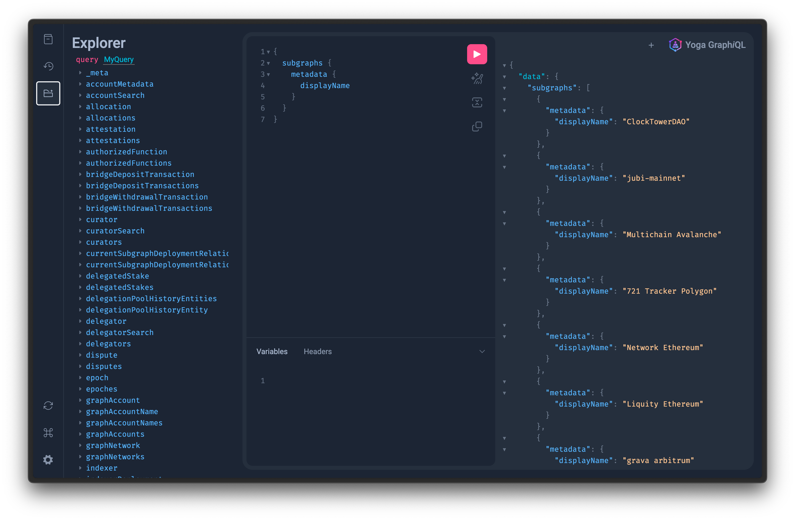

# 🛠️ Combining Multiple Subgraphs with Graph Client

[](https://bit.ly/47afnwj)

## Steps

### Create new Scaffold-ETH project

Learn more about Scaffold-ETH here: https://scaffoldeth.io/

1. Run init command:

```bash
npx create-eth@latest
```

->

```bash
 +-+-+-+-+-+-+-+-+-+-+-+-+-+-+
 | Create Scaffold-ETH 2 app |
 +-+-+-+-+-+-+-+-+-+-+-+-+-+-+

? Your project name: subgraph-composition
? What solidity framework do you want to use? None
? Install packages? Yes

  ✔ 📁 Create project directory /Users/schmidsi/Development/@schmidsi/subgraph-composition
  ✔ 🚀 Creating a new Scaffold-ETH 2 app in subgraph-composition
  ✔ 📦 Installing dependencies with yarn, this could take a while
  ✔ 📡 Initializing Git repository

  Congratulations! Your project has been scaffolded! 🎉

  Next steps:

  cd subgraph-composition

  	In a new terminal window, start the frontend
  	yarn start

  Thanks for using Scaffold-ETH 2 🙏, Happy Building!
```

2. Check if it worked:

```bash

cd subgraph-composition
yarn start
```

Navigate to: http://localhost:3000

### Get an API Key for The Graph

Go to: https://thegraph.com/studio/apikeys/

--> `dc9b1200d80a1c064c90462b9c04f264` This is mine, you should create your own.

### Find the subgraphs that we want to query

- https://thegraph.com/explorer/subgraphs/DjUVVVSuKcCCTZSVzVXLioSd7AdqwGEyBrY4Ru5tuqzX?view=Playground&chain=arbitrum-one
- https://thegraph.com/explorer/subgraphs/AwyZBdna4vTAHiqBWsrQ5ErFRMi6HCgGEkQMgNBseWTL?view=Playground&chain=arbitrum-one

1. Let's start with one. Get the query URL:

`https://gateway-arbitrum.network.thegraph.com/api/[api-key]/subgraphs/id/AwyZBdna4vTAHiqBWsrQ5ErFRMi6HCgGEkQMgNBseWTL`

2. Replace `[api-key]` with your API key:

`https://gateway-arbitrum.network.thegraph.com/api/dc9b1200d80a1c064c90462b9c04f264/subgraphs/id/AwyZBdna4vTAHiqBWsrQ5ErFRMi6HCgGEkQMgNBseWTL`

### Initalize Graph Client

Learn more about Graph Client: https://github.com/graphprotocol/graph-client/

1. Install GraphQL dependencies in nextjs folder

```bash
cd packages/nextjs
yarn add graphql
```

2. Install the Graph Client CLI locally (this is different from Graph CLI)

```bash
yarn add -D @graphprotocol/client-cli
```

3. Create the configuration file ([example](./packages/nextjs/.graphclientrc.yml))):

```yml
# .graphclientrc.yml
sources:
  - name: mainnet
    handler:
      graphql:
        endpoint: https://gateway-arbitrum.network.thegraph.com/api/dc9b1200d80a1c064c90462b9c04f264/subgraphs/id/AwyZBdna4vTAHiqBWsrQ5ErFRMi6HCgGEkQMgNBseWTL
```

4. Run the Graph Client development server:

```bash
yarn graphclient serve-dev
```

5. Open Graph Client GraphiQL in your browser (should happen automatically):

http://localhost:4000/

### Hook up Graph Client to React

Let's start with a very simple query and hook it to React:

```graphql
query Subgraphs {
  subgraphs {
    id
    metadata {
      displayName
    }
  }
}
```

_hint_: Be sure to use named queries (`query Subgraphs {}`) instead of anonymous queries (`{}`) because Graph Client does not support anonymous queries.

1. Get a query

Type this query in the GraphiQL interface and hit the play button to see the result.

http://localhost:4000/graphql?query=%7B%0A++subgraphs+%7B%0A++++metadata+%7B%0A++++++displayName%0A++++%7D%0A++%7D%0A%7D



We can use the GraphiQL explorer to build a more complex query. Just click on the folder icon in the right sidebar to open it. In fact, this is a great tool to explore the data that is available in the subgraph. We can play around with it until we find a good query.

2. Store the query in a file

With Graph Client, we can separate GraphQL queries from our React components. This is a good practice because it makes our code more readable and maintainable. I suggest to use the path: [`./queries/Subgraphs.gql`](./queries/Subgraphs.gql). Also, Graph Client generates TypeScript types for us, so we can use them in our React components.

And then extend [`.graphclientrc.yml`](./packages/nextjs/.graphclientrc.yml) with the following:

```yml
# other content
documents:
  - "./queries/**/*.graphql"
```

3. Build Graph Client helper files

```bash
yarn graphclient build
```

This generates a bunch of helper files, located by default in [`.graphclient/`](./packages/nextjs/.graphclient/) folder.

4. Run a query in React

Open up [`./packages/nextjs/pages/index.tsx`](./packages/nextjs/pages/index.tsx) and change it to the following code:

```tsx
import { useEffect, useState } from "react";
import { ExecutionResult } from "graphql";
import type { NextPage } from "next";
import { SubgraphsDocument, SubgraphsQuery, execute } from "~~/.graphclient";
import { MetaHeader } from "~~/components/MetaHeader";

const Home: NextPage = () => {
  // `SubgraphsQuery` is generated by Graph Client and contains the types for our query.
  // This comes very handy later while developing
  const [result, setResult] = useState<ExecutionResult<SubgraphsQuery>>();

  // Simple React hook to run the query on page load
  useEffect(() => {
    execute(SubgraphsDocument, {}).then((result) => {
      setResult(result);
      console.log(result);
    });
  }, []);

  return (
    <>
      <MetaHeader />
      <div className="flex items-center flex-col flex-grow pt-10">
        <div className="px-5">
          <h1 className="text-center">
            <span className="block text-4xl font-bold">Query The Graph</span>
          </h1>
        </div>

        <div className="flex-grow bg-base-300 w-full mt-16 px-8 py-12">
          <ul>
            {result?.data?.subgraphs.map((subgraph) => (
              <li>{subgraph.metadata?.displayName}</li>
            ))}
          </ul>
        </div>
      </div>
    </>
  );
};

export default Home;
```

_hint_: In the example above, we use the bare functions provided by Graph Client directly. Graph Client also nicely integrates with [Apollo](https://github.com/graphprotocol/graph-client/tree/main/examples/apollo), [URQL](https://github.com/graphprotocol/graph-client/blob/main/examples/urql) and [React Query](https://github.com/graphprotocol/graph-client/blob/main/examples/react-query).

Now we can navigate to http://localhost:4000/ and see a list of subgraph names.

### Combine multiple subgraphs

So far, we enjoyed the increased developer experience by having generated types for our queries and separation of concerns with GraphQL queries in separate files. But we haven't really combined multiple subgraphs yet. Let's do that now.

1. Add another subgraph to the configuration file

```yml
# .graphclientrc.yml
sources:
  - name: mainnet
    handler:
      graphql:
        endpoint: https://gateway-arbitrum.network.thegraph.com/api/dc9b1200d80a1c064c90462b9c04f264/subgraphs/id/AwyZBdna4vTAHiqBWsrQ5ErFRMi6HCgGEkQMgNBseWTL

  # this is new 👇
  - name: arbitrum
    handler:
      graphql:
        endpoint: https://gateway-arbitrum.network.thegraph.com/api/dc9b1200d80a1c064c90462b9c04f264/subgraphs/id/AwyZBdna4vTAHiqBWsrQ5ErFRMi6HCgGEkQMgNBseWTL
# ... rest of the file
```

## Caveats

If you change the queries or configuration files, always rebuild the Graph Client helper files:

```bash
yarn graphclient build
```

## Notes

Complete query:

```graphql
{
  subgraphs(
    first: 1000
    orderBy: currentSignalledTokens
    orderDirection: desc
    where: { entityVersion: 2 }
  ) {
    active
    createdAt
    creatorAddress
    currentSignalledTokens
    id
    migrated
    oldID
    updatedAt
    versionCount
    currentVersion {
      createdAt
      entityVersion
      id
      metadataHash
      version
      subgraphDeployment {
        id
        originalName
        ipfsHash
      }
    }
    metadata {
      id
      image
      nftImage
      website
      description
      displayName
      codeRepository
    }
  }
}
```
